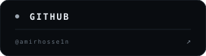
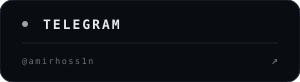

  

## `01 / IDENTITY`

  

## `02 / TECH STACK`

  

## `05 / CONTRIBUTION GRAPH`

  

  
<b>Contribution animation</b>

   
  

    
  

## `06 / 3D ANIMATED PROFILE`

  

  
<b>Alternate 3D view</b>

   
  

    
  

## `07 / CONNECT WITH ME`

  
  &nbsp;
  
  &nbsp;
  

  

