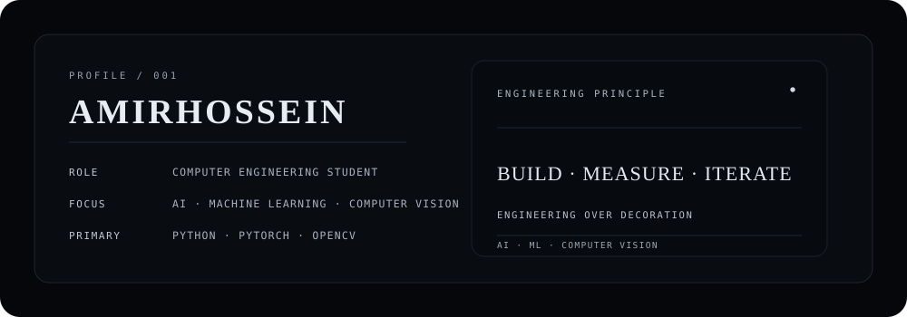
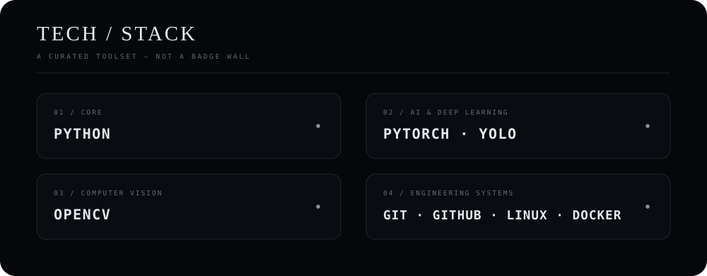
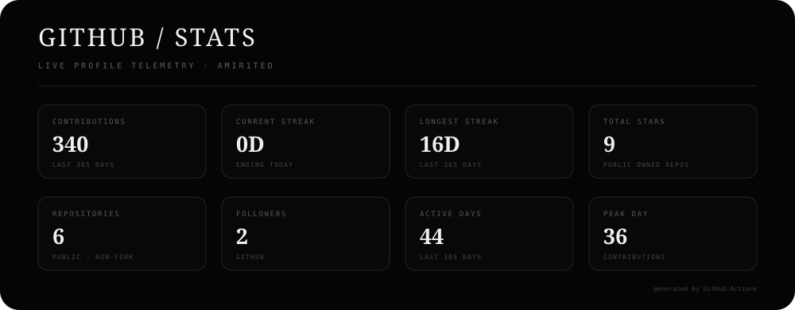
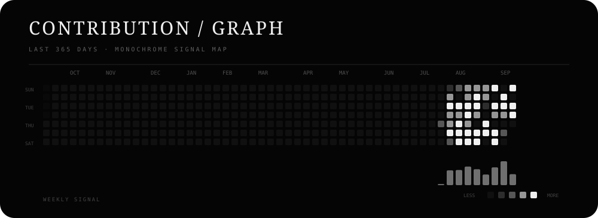
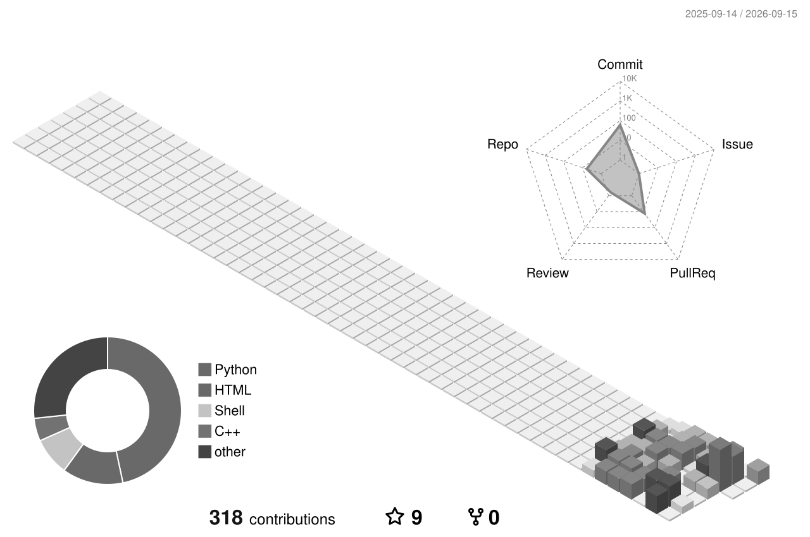
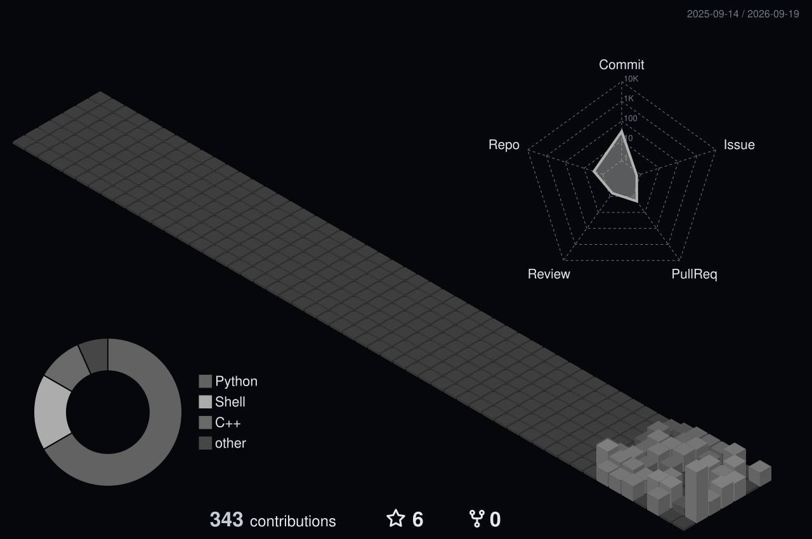

  

  
  
  

## `01 / IDENTITY`

  

## `02 / TECH STACK`

  

## `03 / NEURAL SKILL ATLAS`

  

## `04 / GITHUB STATS`

  

## `05 / CONTRIBUTION GRAPH`

  

  

## `06 / 3D ANIMATED PROFILE`

  

<b>More monochrome 3D views</b>

 

  

## `07 / CONNECT WITH ME`

  
  
  

GitHub for the work · LinkedIn for the professional side · Telegram for a direct line.

<code>while alive: learn(); build(); refine()</code>

