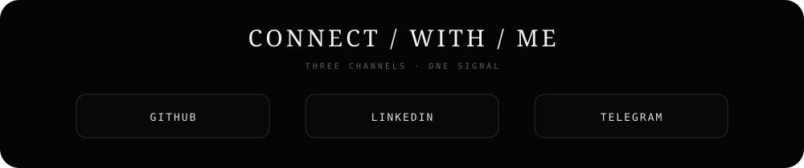

  

  <a href="https://github.com/Amir1ted"><b>GITHUB</b></a>
  &nbsp;&nbsp;·&nbsp;&nbsp;
  <a href="https://www.linkedin.com/in/amir-h-faeeghi-43165641b"><b>LINKEDIN</b></a>
  &nbsp;&nbsp;·&nbsp;&nbsp;
  <a href="https://t.me/amirhoss1n"><b>TELEGRAM</b></a>

 

## `01 / IDENTITY`

  

## `02 / TECH STACK`

  

## `03 / NEURAL SKILL ATLAS`

  

## `04 / GITHUB STATS`

  

## `05 / CONTRIBUTION GRAPH`

  
    
  

## `06 / 3D ANIMATED PROFILE`

  
    
  

    
<b>More monochrome 3D views</b>

     
    
  

## `07 / CONNECT WITH ME`

  
    
  <a href="https://github.com/Amir1ted"><b>GitHub</b></a>
  &nbsp;&nbsp;&nbsp;•&nbsp;&nbsp;&nbsp;
  <a href="https://www.linkedin.com/in/amir-h-faeeghi-43165641b"><b>LinkedIn</b></a>
  &nbsp;&nbsp;&nbsp;•&nbsp;&nbsp;&nbsp;
  <a href="https://t.me/amirhoss1n"><b>Telegram</b></a>

 

  

