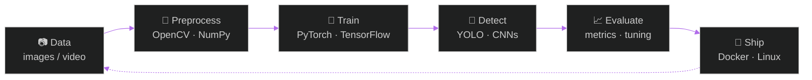

<div align="center">


# Hey there 

<a href="https://github.com/Amir1ted">
  
</a>


</div>

---

## 🎯 Current Focus

My end-to-end workflow when I build a computer-vision project:



| Area | What I'm doing | Status |
| :--- | :--- | :--- |
| 👁️ **Computer Vision** | Detection, tracking, image understanding | `in progress` |
| 🧠 **Deep Learning** | CNNs, transfer learning, model tuning | `in progress` |
| 📚 **Classic ML** | scikit-learn pipelines, feature engineering | `solid` |
| 🐍 **Python** | Clean, reproducible, well-structured code | `daily driver` |
| 🐧 **Linux / Docker** | Reproducible environments, automation | `improving` |

---

## About Me

```yaml
name:      Amir
location:  Iran
role:      Computer Engineering Student
focus:     Artificial Intelligence · Machine Learning · Computer Vision
language:  Python (main)
os:        Ubuntu Linux
learning:  Computer Vision — deep dive
motto:     "every great story starts with 'i lost everything.'"
```

- 🧠 &nbsp;Python developer focused on **AI, Machine Learning and Computer Vision**
- 👁️ &nbsp;Currently going deep into **Computer Vision** — detection, tracking and image understanding
- 🐧 &nbsp;**Linux enthusiast**, living inside **Ubuntu** and the terminal
- 🧪 &nbsp;I like turning research papers and ideas into working code
- 🎓 &nbsp;**Computer Engineering** student — hardware intuition, software obsession
- ⚡ &nbsp;Always building, always breaking, always learning

---

##  Tech Stack

<div align="center">

**Languages**


**AI / ML / Computer Vision**


**Tools & OS**


</div>

---

##  GitHub Stats

<div align="center">


</div>

---

## 💬 Dev Quote

<div align="center">


</div>

---

<div align="center">

```
▸ while (alive) { learn(); build(); repeat(); }
```


</div>
