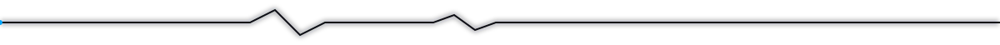
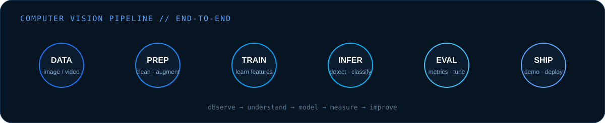
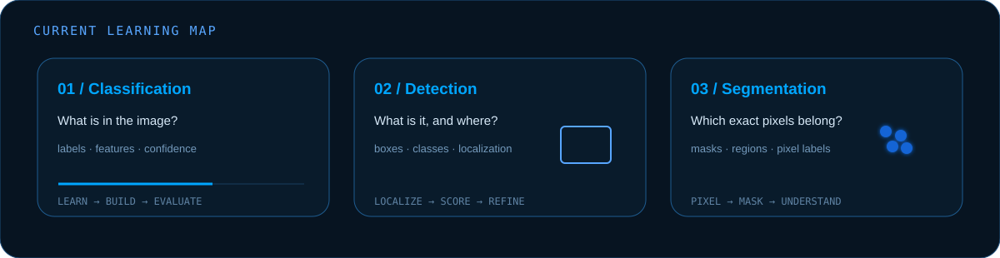
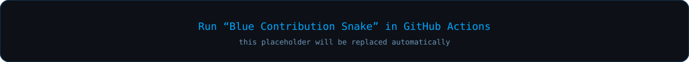

<!-- ========================================================= -->
<!-- AMIR1TED — BLUE NEURAL PROFILE                             -->
<!-- Original profile concept inspired by modern profile READMEs -->
<!-- Custom identity, visuals and animations built for Amir.     -->
<!-- ========================================================= -->

<a href="https://github.com/Amir1ted">
  
</a>

<p align="center">
  
</p>

<p align="center">
  <a href="https://github.com/Amir1ted">
    
  </a>
</p>

<div align="center">
  
</div>

<p align="center">
  <a href="https://github.com/Amir1ted"></a>
  <a href="https://github.com/Amir1ted?tab=followers"></a>
  <a href="https://github.com/Amir1ted?tab=repositories"></a>
</p>

<p align="center">
  
</p>

<h2 align="center">🧠 About Me</h2>

```python
class Amir:
    """Computer Engineering student focused on intelligent visual systems."""

    name          = "Amir"
    location      = "Iran"
    role          = "Computer Engineering Student"
    main_language = "Python"

    focus = [
        "Artificial Intelligence",
        "Machine Learning",
        "Computer Vision",
    ]

    learning_path = [
        "Image Classification",
        "Object Detection",
        "Image Segmentation",
    ]

    environment = "Ubuntu Linux"

    def philosophy(self) -> str:
        return "Learn deeply. Build simply. Improve continuously."


me = Amir()
print(me.philosophy())
```

<p align="center">
  <i>I am interested in the point where software stops merely processing data and starts understanding visual information.</i>
</p>

<p align="center">
  
</p>

<h2 align="center">👁️ Computer Vision Pipeline</h2>

<p align="center">
  
</p>

<h2 align="center">🎯 Current Learning Map</h2>

<p align="center">
  
</p>

<p align="center">
  
</p>

<h2 align="center">⚙️ Toolbox & Ecosystem</h2>

<p align="center"><b>Core</b></p>
<p align="center">
  
</p>

<p align="center"><b>AI / ML / Computer Vision — learning & building ecosystem</b></p>
<p align="center">
  
</p>

<p align="center"><b>Development Environment</b></p>
<p align="center">
  
</p>

<p align="center">
  
  
  
</p>

<p align="center">
  
</p>

<h2 align="center">📊 GitHub Analytics</h2>

<p align="center">
  
  
</p>

<p align="center">
  
</p>

<p align="center">
  
</p>

<p align="center">
  
</p>

<h2 align="center">🚀 Selected Builds</h2>

<p align="center">
  <a href="https://github.com/Amir1ted/calculator">
    
  </a>
  <a href="https://github.com/Amir1ted/tailscale-installer">
    
  </a>
</p>

<p align="center">
  <a href="https://github.com/Amir1ted/pdf-merger">
    
  </a>
  <a href="https://github.com/Amir1ted/Algorithms">
    
  </a>
</p>

> **Next evolution:** replace these cards with dedicated AI/CV projects as they are published — classification, detection, segmentation and end-to-end vision systems.

<p align="center">
  
</p>

<h2 align="center">🐍 Contribution Stream</h2>

<p align="center">
  
</p>

<sub>Generated automatically by GitHub Actions. Run the workflow once after adding these files.</sub>

<h2 align="center">🌌 3D Contribution Landscape</h2>

<p align="center">
  
</p>

<sub>Generated automatically by the included 3D contribution workflow.</sub>

<p align="center">
  
</p>

<h2 align="center">📡 Signal</h2>

<p align="center">
  <code>pixels → patterns → predictions → understanding</code>
</p>

<p align="center">
  <a href="https://github.com/Amir1ted?tab=repositories"></a>
</p>

<div align="center">
  
</div>
